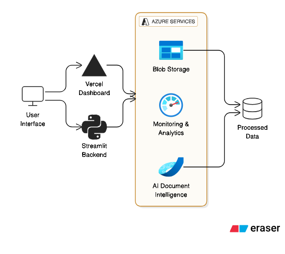

# 🔒 DocuVision AI – Enterprise Document Intelligence Platform

> **Enterprise-grade document processing with AI-powered insights, real-time analytics, and secure cloud deployment.**

---

## 🚀 Live Demo Dashboards

### 🌐 **Production Deployments**

| Dashboard | Platform | Live URL | Description |
|-----------|----------|----------|-------------|
| **📊 Main Dashboard** | Vercel | [**securedoc-ai-dashboard.vercel.app**](https://securedoc-ai-dashboard-bsipgjkwj-ajalmohammads-projects.vercel.app) | Interactive HTML dashboard with real-time analytics |
| **📋 Project Portfolio** | GitHub | [**View Portfolio**](https://github.com/AJ-Almohammad/DocuVision-AI-Platform/blob/main/cloud-deployment-portfolio.html) | Comprehensive project documentation & architecture |

### 🎯 **Quick Access**
\\\ash
# Live Dashboard: https://securedoc-ai-dashboard-bsipgjkwj-ajalmohammads-projects.vercel.app
# Project Portfolio: https://github.com/AJ-Almohammad/DocuVision-AI-Platform/blob/main/cloud-deployment-portfolio.html
\\\

---

## 📋 Table of Contents
- [Features](#-features)
- [Architecture](#-architecture)
- [Quick Start](#-quick-start)
- [Project Structure](#-project-structure)
- [API Documentation](#-api-documentation)
- [Deployment](#-deployment)
- [Development](#-development)

## ✨ Features

### 🤖 AI-Powered Document Processing
- **Intelligent OCR** - Extract text from PDFs, images, and documents
- **Table Recognition** - Automatically detect and parse tabular data
- **Layout Analysis** - Understand document structure and formatting
- **Content Classification** - Categorize documents by type and purpose

### 📊 Real-Time Analytics
- **Live Monitoring** - Track document processing in real-time
- **Cost Analytics** - Monitor Azure resource usage and spending
- **Performance Metrics** - Processing times, success rates, and throughput
- **Interactive Visualizations** - Charts, gauges, and trend analysis

### 🔒 Enterprise Security
- **Azure AD Integration** - Role-based access control
- **Secure Storage** - Encrypted blob storage with SAS tokens
- **Audit Logging** - Comprehensive activity monitoring
- **Compliance Ready** - Enterprise security standards

## 🏗 Architecture

*Figure: DocuVision AI Platform Architecture - Multi-cloud deployment with Azure backend and Vercel frontend*

### Architecture Overview
- **Frontend Layer**: Vercel-hosted HTML dashboard with real-time UI
- **Backend Layer**: Azure App Service with Streamlit and FastAPI
- **AI Services**: Azure Document Intelligence for OCR and analysis
- **Storage**: Azure Blob Storage for document management
- **Security**: Azure AD integration and encrypted data storage

## 🚀 Quick Start

### Prerequisites
- Python 3.9+
- Azure Account with Cognitive Services
- Node.js 16+ (for web dashboard)

### Local Development
\\\ash
# 1. Clone repository
git clone https://github.com/AJ-Almohammad/DocuVision-AI-Platform.git
cd DocuVision-AI-Platform

# 2. Setup Python environment
python -m venv venv
source venv/bin/activate  # Windows: venv\Scripts\activate
pip install -r requirements.txt

# 3. Launch Streamlit dashboard (Backend)
streamlit run dashboard_enhanced.py

# 4. Launch Web Dashboard (Frontend)
cd securedoc-ai-vercel
python -m http.server 8000
# Visit http://localhost:8000
\\\

### Production Deployment
\\\ash
# Deploy to Vercel
cd securedoc-ai-vercel
vercel --prod
\\\

## 📁 Project Structure

DocuVision-AI-Platform/
├── 🌐 Live Deployments
│   ├── securedoc-ai-vercel/          # Vercel Dashboard (Production)
│   │   ├── index.html                # Main dashboard
│   │   ├── portfolio.html            # Project portfolio
│   │   ├── vercel.json              # Deployment config
│   │   └── package.json             # Dependencies
│   └── dashboard_enhanced.py         # Azure Streamlit Backend
├── 💻 Core Application
│   ├── src/
│   │   ├── data_ingestion/
│   │   │   └── storage_client.py     # Azure Blob Storage
│   │   ├── data_processing/
│   │   │   └── document_processor.py # AI Document Processing
│   │   ├── api/
│   │   │   ├── main.py              # FastAPI Service
│   │   │   └── simple_main.py       # Simplified API
│   │   └── auth/
│   │       ├── authentication.py    # Security Layer
│   │       └── simple_auth.py       # Basic Auth
│   └── config/
│       └── settings.py              # Configuration
├── ⚙️ Automation Scripts
│   ├── scripts/
│   │   ├── azure_setup.py           # Infrastructure provisioning
│   │   ├── azure_cleanup.py         # Resource cleanup
│   │   ├── check_costs.py           # Cost optimization
│   │   ├── process_document.py      # Document pipeline
│   │   ├── validate_security.py     # Security audit
│   │   └── upload_sample.py         # Test data upload
└── 📚 Documentation
    ├── docs/
    │   ├── Amer-Almohammad-Data-Engineer-CV-2024.md
    │   └── COVER_LETTER_TEMPLATE.md
    ├── requirements.txt
    └── README.md

## 🔌 API Documentation

### Core Endpoints
\\\python
# Document Processing
POST /api/v1/documents/upload     # Upload document
GET  /api/v1/documents/{id}       # Get processing results
POST /api/v1/documents/analyze    # AI analysis

# Analytics
GET  /api/v1/analytics/metrics    # Performance metrics
GET  /api/v1/analytics/costs      # Cost tracking
\\\

### Example Usage
\\\python
import requests

# Upload document for processing
response = requests.post(
    "https://securedoc-ai-amer.azurewebsites.net/api/v1/documents/upload",
    files={"file": open("document.pdf", "rb")}
)
\\\

## 🌐 Deployment

### Vercel (Frontend)
- **Framework**: Static HTML
- **Build Command**: None (static deployment)
- **Output Directory**: securedoc-ai-vercel

## 🛠 Development

### Running Tests
\\\ash
# Run all test scripts
python scripts/test_api.py
python scripts/validate_security.py
python scripts/process_document.py --test
\\\

### Code Quality
\\\ash
# Format code
black .
flake8 .

# Type checking
mypy src/
\\\

## 👨‍💻 Author

**Amer Almohammad**  
*AWS Junior Cloud Engineer | AWS Junior Solutions Architect*

- 📧 **Email**: ajaber1973@web.de
- 💼 **LinkedIn**: [Amer Almohammad](https://linkedin.com/in/ameralmohammad)
- 🐙 **GitHub**: [AJ-Almohammad](https://github.com/AJ-Almohammad)
- 🌐 **Portfolio**: [Project Portfolio](https://github.com/AJ-Almohammad/DocuVision-AI-Platform/blob/main/cloud-deployment-portfolio.html)

## 📄 License

This project is licensed under the MIT License - see the [LICENSE](LICENSE) file for details.

---

### ⭐ Support the Project

If this project helped you, please give it a star on GitHub!

[**🐛 Report Bug**](https://github.com/AJ-Almohammad/DocuVision-AI-Platform/issues) • 
[**💡 Request Feature**](https://github.com/AJ-Almohammad/DocuVision-AI-Platform/issues) • 
[**📖 View Documentation**](https://github.com/AJ-Almohammad/DocuVision-AI-Platform/blob/main/cloud-deployment-portfolio.html)

