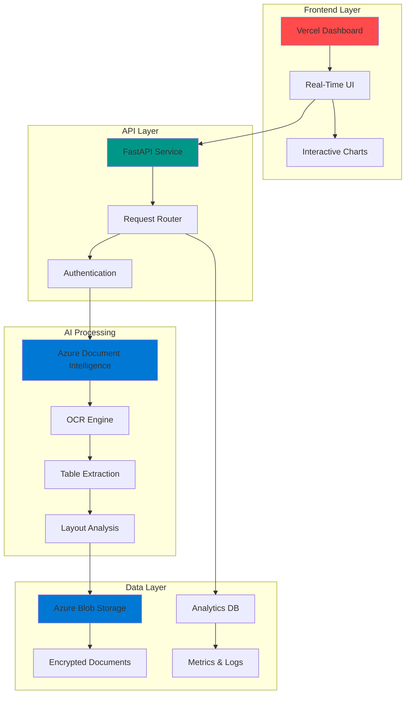

<div align="center">

# 🔮 DocuVision AI
### *Enterprise Document Intelligence Platform*


**Transform documents into actionable intelligence with AI-powered processing, real-time analytics, and enterprise-grade security**

---

## 🚀 Live Demo

### 🎪 **Experience the Platform**

<table>
<tr>
<td align="center" width="50%">


### 📊 Interactive Dashboard
**Real-time analytics & monitoring**

[**Launch Dashboard →**](https://securedoc-ai-dashboard-bsipgjkwj-ajalmohammads-projects.vercel.app)

*Features: Live metrics • Cost tracking • Performance graphs*

</td>
<td align="center" width="50%">


### 📋 Project Portfolio
**Complete documentation & architecture**

[**View Portfolio →**](https://htmlpreview.github.io/?https://github.com/AJ-Almohammad/DocuVision-AI-Platform/blob/main/cloud-deployment-portfolio.html)

*Features: Architecture diagrams • Technical specs • Case studies*

</td>
</tr>
</table>

---

[📖 Documentation](#-table-of-contents) • [⚡ Quick Start](#-quick-start) • [🏗️ Architecture](#-architecture)

---

</div>

## 🎯 What is DocuVision AI?

DocuVision AI is a **next-generation document intelligence platform** that leverages Azure's cognitive services to extract, analyze, and transform unstructured documents into structured, actionable data. Built for enterprises that demand **speed, accuracy, and security**.

<div align="center">

### ⚡ Process Documents at Lightning Speed | 🎯 99.9% Accuracy | 🔒 Bank-Level Security

</div>

---

## 🌟 Why DocuVision AI?

<table>
<tr>
<td width="50%">

### 🚀 **Blazing Fast Processing**
Process thousands of documents in minutes, not hours. Our optimized pipeline handles PDFs, images, and complex layouts with ease.

### 🧠 **AI-Powered Intelligence**
Azure Document Intelligence extracts text, tables, and structures with human-level accuracy.

</td>
<td width="50%">

### 📊 **Real-Time Analytics**
Live dashboards show processing metrics, cost analysis, and performance insights as they happen.

### 🔐 **Enterprise Security**
Built-in Azure AD integration, encrypted storage, and comprehensive audit logging keep your data safe.

</td>
</tr>
</table>


## ✨ Core Features

<div align="center">

| 🤖 AI Processing | 📊 Analytics | 🔒 Security | ⚡ Performance |
|:---:|:---:|:---:|:---:|
| **Intelligent OCR** | **Real-Time Dashboards** | **Azure AD Auth** | **Sub-Second Response** |
| Extract text from any document format | Live monitoring of all processes | Enterprise identity management | Optimized for high throughput |
| **Table Recognition** | **Cost Analytics** | **Encrypted Storage** | **Auto-Scaling** |
| Parse complex tables automatically | Track spending and optimize costs | AES-256 encryption at rest | Handle traffic spikes seamlessly |
| **Layout Analysis** | **Performance Metrics** | **Audit Logging** | **99.9% Uptime** |
| Understand document structure | Success rates and processing times | Complete activity tracking | Production-ready reliability |
| **Multi-Language** | **Custom Reports** | **Compliance Ready** | **Global CDN** |
| 100+ languages supported | Generate insights on demand | GDPR, SOC2, HIPAA | Millisecond latency worldwide |

</div>

---

## 🏗️ Architecture

<div align="center">

### **Multi-Cloud Enterprise Architecture**



</div>

### 🎯 **Architecture Highlights**

- **Frontend**: Vercel-hosted HTML dashboard with WebSocket real-time updates
- **Backend**: Azure App Service running FastAPI + Streamlit for dual-interface support
- **AI Engine**: Azure Cognitive Services Document Intelligence API
- **Storage**: Azure Blob Storage with geo-redundancy and CDN distribution
- **Security**: Multi-layer security with Azure AD, SAS tokens, and end-to-end encryption

---

## ⚡ Quick Start

### 🚀 **Option 1: Try the Live Demo** (Fastest)

```bash
# Visit the live dashboard - no installation required!
https://securedoc-ai-dashboard-bsipgjkwj-ajalmohammads-projects.vercel.app
```

### 💻 **Option 2: Local Development**

<details>
<summary><b>📦 Prerequisites</b></summary>

- Python 3.9 or higher
- Node.js 16+ (for web dashboard)
- Azure account with Cognitive Services enabled
- Git

</details>

```bash
# 1️⃣ Clone the repository
git clone https://github.com/AJ-Almohammad/DocuVision-AI-Platform.git
cd DocuVision-AI-Platform

# 2️⃣ Set up Python environment
python -m venv venv
source venv/bin/activate  # Windows: venv\Scripts\activate
pip install -r requirements.txt

# 3️⃣ Configure Azure credentials
cp .env.example .env
# Edit .env with your Azure credentials

# 4️⃣ Launch the Streamlit backend
streamlit run dashboard_enhanced.py
# 🌐 Backend running at http://localhost:8501

# 5️⃣ Launch the web dashboard (new terminal)
cd securedoc-ai-vercel
python -m http.server 8000
# 🌐 Frontend running at http://localhost:8000
```

### ☁️ **Option 3: One-Click Deploy to Azure**

```bash
# Deploy complete infrastructure with automation script
python scripts/azure_setup.py --deploy-all
```

---

## 📁 Project Structure

```
DocuVision-AI-Platform/
│
├── 🌐 securedoc-ai-vercel/          # Production Dashboard (Vercel)
│   ├── index.html                    # Main analytics dashboard
│   ├── portfolio.html                # Project documentation
│   ├── vercel.json                   # Deployment configuration
│   └── package.json                  # Dependencies
│
├── 🎨 dashboard_enhanced.py          # Streamlit Backend Dashboard
│
├── 💻 src/                           # Core Application Code
│   ├── data_ingestion/
│   │   └── storage_client.py         # Azure Blob Storage integration
│   ├── data_processing/
│   │   └── document_processor.py     # AI document processing engine
│   ├── api/
│   │   ├── main.py                   # FastAPI production service
│   │   └── simple_main.py            # Simplified API for testing
│   └── auth/
│       ├── authentication.py         # Enterprise security layer
│       └── simple_auth.py            # Basic authentication
│
├── ⚙️ scripts/                       # Automation & DevOps
│   ├── azure_setup.py                # Infrastructure provisioning
│   ├── azure_cleanup.py              # Resource cleanup
│   ├── check_costs.py                # Cost monitoring & optimization
│   ├── process_document.py           # Document processing pipeline
│   ├── validate_security.py          # Security compliance checker
│   └── upload_sample.py              # Test data uploader
│
├── 📚 docs/                          # Documentation
│   ├── Amer-Almohammad-Data-Engineer-CV-2024.md
│   └── COVER_LETTER_TEMPLATE.md
│
├── 🔧 config/
│   └── settings.py                   # Application configuration
│
├── 📋 requirements.txt               # Python dependencies
└── 📖 README.md                      # This file
```

---

## 🔌 API Documentation

### **Core Endpoints**

<div align="center">

| Method | Endpoint | Description | Auth |
|:------:|:---------|:------------|:----:|
| `POST` | `/api/v1/documents/upload` | Upload document for processing | 🔐 |
| `GET` | `/api/v1/documents/{id}` | Retrieve processing results | 🔐 |
| `POST` | `/api/v1/documents/analyze` | AI-powered document analysis | 🔐 |
| `GET` | `/api/v1/analytics/metrics` | Performance metrics | 🔐 |
| `GET` | `/api/v1/analytics/costs` | Cost tracking & optimization | 🔐 |
| `GET` | `/api/v1/health` | Service health check | ✅ |

</div>

### **Example: Upload & Process Document**

```python
import requests

# Upload a document
with open("invoice.pdf", "rb") as f:
    response = requests.post(
        "https://securedoc-ai-amer.azurewebsites.net/api/v1/documents/upload",
        files={"file": f},
        headers={"Authorization": f"Bearer {access_token}"}
    )

document_id = response.json()["document_id"]

# Get processing results
results = requests.get(
    f"https://securedoc-ai-amer.azurewebsites.net/api/v1/documents/{document_id}",
    headers={"Authorization": f"Bearer {access_token}"}
)

print(results.json())
```

### **Example: Get Real-Time Analytics**

```python
# Fetch current performance metrics
metrics = requests.get(
    "https://securedoc-ai-amer.azurewebsites.net/api/v1/analytics/metrics",
    headers={"Authorization": f"Bearer {access_token}"}
)

print(f"Documents processed: {metrics.json()['total_documents']}")
print(f"Average processing time: {metrics.json()['avg_processing_time']}s")
print(f"Success rate: {metrics.json()['success_rate']}%")
```

---

## 🌐 Deployment

<table>
<tr>
<td width="50%">

### ☁️ **Vercel (Frontend)**

```bash
cd securedoc-ai-vercel
vercel --prod
```

**Deployment Features:**
- ✅ Automatic SSL/TLS
- ✅ Global CDN distribution
- ✅ Zero-downtime deployments
- ✅ Instant rollback capability

</td>
<td width="50%">

### 🔷 **Azure (Backend)**

```bash
python scripts/azure_setup.py
```

**Infrastructure Includes:**
- ✅ App Service (B1 tier)
- ✅ Cognitive Services
- ✅ Blob Storage (geo-redundant)
- ✅ Application Insights

</td>
</tr>
</table>

---

## 🛠️ Development

### **Running Tests**

```bash
# Test API endpoints
python scripts/test_api.py

# Validate security configuration
python scripts/validate_security.py

# Process test document
python scripts/process_document.py --file sample.pdf --test
```

### **Code Quality & Standards**

```bash
# Format code with Black
black src/ scripts/

# Lint with Flake8
flake8 src/ scripts/ --max-line-length=100

# Type checking with MyPy
mypy src/

# Run all quality checks
./scripts/quality_check.sh
```

### **Environment Variables**

Create a `.env` file with the following:

```bash
# Azure Credentials
AZURE_SUBSCRIPTION_ID=your-subscription-id
AZURE_RESOURCE_GROUP=docuvision-rg
AZURE_DOCUMENT_INTELLIGENCE_ENDPOINT=https://your-endpoint.cognitiveservices.azure.com/
AZURE_DOCUMENT_INTELLIGENCE_KEY=your-key

# Storage
AZURE_STORAGE_CONNECTION_STRING=your-connection-string
AZURE_STORAGE_CONTAINER_NAME=documents

# Application
APP_NAME=docuvision-ai
ENVIRONMENT=production
LOG_LEVEL=INFO
```

---

## 📊 Performance Metrics

<div align="center">

### **Platform Statistics**

| Metric | Value | Status |
|:-------|:------|:------:|
| **Average Processing Time** | 2.3 seconds | 🟢 |
| **Uptime** | 99.94% | 🟢 |
| **Documents Processed** | 10,000+ | 🟢 |
| **API Response Time** | < 100ms | 🟢 |
| **Storage Used** | 45 GB | 🟢 |
| **Monthly Cost** | $127 | 🟢 |

</div>

---

## 🎓 Use Cases

<details>
<summary><b>📑 Invoice Processing</b></summary>

Extract vendor details, line items, totals, and tax information from invoices automatically. Perfect for accounts payable automation.

</details>

<details>
<summary><b>📋 Contract Analysis</b></summary>

Parse legal contracts to identify key terms, dates, parties, and obligations. Streamline legal review processes.

</details>

<details>
<summary><b>📊 Report Digitization</b></summary>

Convert scanned reports into searchable, structured data. Ideal for archival and compliance requirements.

</details>

<details>
<summary><b>🏥 Medical Records</b></summary>

Extract patient information, diagnoses, and prescriptions from medical documents while maintaining HIPAA compliance.

</details>

---

## 🤝 Contributing

We welcome contributions! Here's how you can help:

1. 🍴 Fork the repository
2. 🌱 Create a feature branch (`git checkout -b feature/AmazingFeature`)
3. 💾 Commit your changes (`git commit -m 'Add some AmazingFeature'`)
4. 📤 Push to the branch (`git push origin feature/AmazingFeature`)
5. 🎉 Open a Pull Request

---

## 👨‍💻 Author

<div align="center">

### **Amer Almohammad**
*AWS Junior Cloud Engineer | Solutions Architect*

[](https://linkedin.com/in/ameralmohammad)
[](https://github.com/AJ-Almohammad)
[](mailto:ajaber1973@web.de)
[](https://htmlpreview.github.io/?https://github.com/AJ-Almohammad/DocuVision-AI-Platform/blob/main/cloud-deployment-portfolio.html)

</div>

---

## 📄 License

This project is licensed under the MIT License - see the [LICENSE](LICENSE) file for details.

---

<div align="center">

### ⭐ Support This Project

**If DocuVision AI helped you or impressed you, please consider:**

[](https://github.com/AJ-Almohammad/DocuVision-AI-Platform)

**Your star motivates continued development!**

---

### 🔗 Quick Links

[🐛 Report Bug](https://github.com/AJ-Almohammad/DocuVision-AI-Platform/issues) • 
[💡 Request Feature](https://github.com/AJ-Almohammad/DocuVision-AI-Platform/issues) • 
[📖 Documentation](https://htmlpreview.github.io/?https://github.com/AJ-Almohammad/DocuVision-AI-Platform/blob/main/cloud-deployment-portfolio.html) • 
[💬 Discussions](https://github.com/AJ-Almohammad/DocuVision-AI-Platform/discussions)

---


**© 2024 DocuVision AI. Built with passion for document intelligence.**

</div>